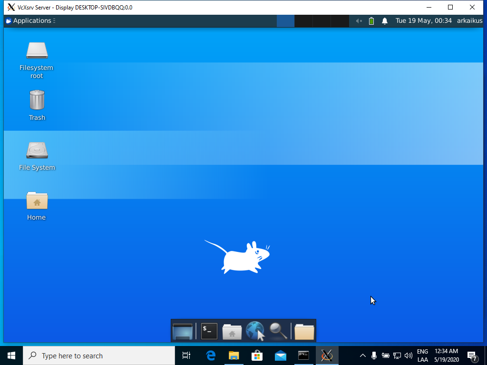

# Windows Subsystem for Linux **Desktop**

## Pasos

1. Activar Modo de Programador, en Configuración-> Actualización y Seguridad-> Para Programadores  


2. Activar la caracteristica "Subsistema de Windows para Linux" en Panel de Control-> Programas y Caracteristicas-> Activar o desactivar las caracteristicas de Windows y reiniciar  


3. Instalar distribución de Linux de preferencia desde la tienda de aplicaciones de microsoft (cada una tiene sus peculiaridades para instalar un manejador de ventanas, para el ejemplo: Ubuntu)  


3.1. Al abrir por primera vez se va a instalar el sistema operativo, luego de unos minutos al presionar la tecla ENTER para actualizar la consola, se pide establecer las credenciales  


3.2. Si se instala ubuntu, windows deja el comando "ubuntu.exe" desde cmd, si se instala debian, deja el comando "debian.exe" desde cmd  
3.2. Ejecutar (o lxde, o xfc4 (revisar como instalarlos)):

```bash
sudo apt update
sudo apt upgrade -y
sudo apt install xubuntu-desktop -y
```

Si es debian se puede instalar lxde, xfce4, y se puede conseguir temas de xfce4 en [xfce-look.org](https://www.xfce-look.org/)  
En este ejemplo se decide instalar el escritorio de xubuntu ya que ubuntu-desktop presentó problemas reconociendo el servidor xorg

4. Instalar [VcXsrv](https://sourceforge.net/projects/vcxsrv/) en windows, xming también sirve, ambos son servidores xorg  
5. Crear una carpeta donde se prefiera para guardar los archivos de los pasos siguientes:  
6. Crear archivo de configuración **config.xlaunch** del servidor xorg con VcXsrv  


> **-swcursor** : toma el estilo del cursor de linux
> **-keyhook**  : permite enviar combinaciones de teclado


7. Descomprimir **pulseaudio-1.x.zip** de [PulseAudio](https://www.freedesktop.org/wiki/Software/PulseAudio/Ports/Windows/Support/) en la carpeta, este nos va a servir para transmitir y poder escuchar el escritorio de linux  
8. Crear un archivo .bat para iniciar el servidor y los procesos correspondientes

```bat
start /B config.xlaunch
start "" /B "<path/to>\pulseaudio\bin\pulseaudio.exe"
ubuntu.exe run "if [ -z \"$(pidof startxfce4)\" ]; then export DISPLAY=127.0.0.1:0.0; export PULSE_SERVER=tcp:127.0.0.1; startxfce4; pkill '(gpg|ssh)-agent'; taskkill.exe /IM pulseaudio.exe /F; taskkill.exe /IM vcxsrv.exe; fi;"
```

9. Ejecutar el archivo .bat, se debería abrir la consola, la ventana del servidor xorg y se debería cargar el manejador de ventanas



## Comentarios

Se instaló el paquete xubuntu-desktop, este paquete viene con todas las aplicaciones por defecto por lo que puede pesar un poco

Se puede instalar lxde, o xfc4 solamente, puede que cargue más rápido pero quedan cortos en ciertas funcionalidades, pero si se requiere lo básico no hay problema, solo es necesario cambiar el nombre del **ejecutable** en linux que despliegue el manejador de ventanas

```bat
ubuntu.exe run "if [ -z \"$(pidof **ejecutable**)\" ]; then export DISPLAY=127.0.0.1:0.0; export PULSE_SERVER=tcp:127.0.0.1; **ejecutable**; pkill '(gpg|ssh)-agent'; taskkill.exe /IM pulseaudio.exe /F; 
```

Puede haber problemas con la **ip del servidor** por lo que puede ser necesario configurarla a la que tenga asignada la máquina

```bat
ubuntu.exe run "if [ -z \"$(pidof startxfce4)\" ]; then export DISPLAY=**ip**:0.0; export PULSE_SERVER=tcp:**ip**; startxfce4; pkill '(gpg|ssh)-agent'; taskkill.exe /IM pulseaudio.exe /F; 
```

Se puede obviar el uso de pulseaudio, solo hay que retirar su presencia en los comandos

Pueda que a veces no se abra bien el servidor de audio y toque cerrar y ejecutar de nuevo el archivo .bat

Se puede crear un acceso directo y cambiar el icono para anclarlo al inicio o enviarlo al escritorio y que parezca un programa más